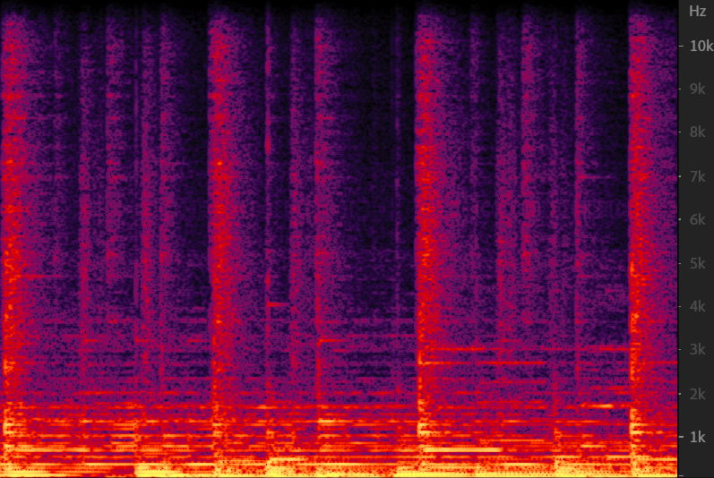
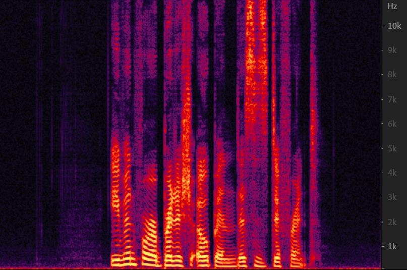
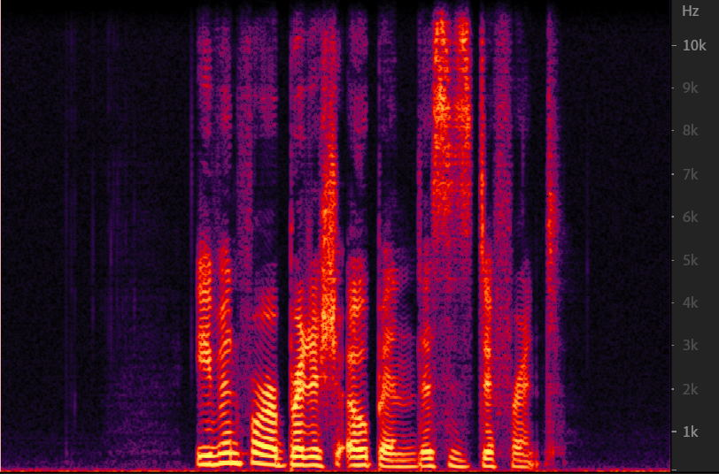

# <h1 align="center">WaveGlow Vocoder</h1>
A vocoder that can convert audio to Mel-Spectrogram and reverse with [WaveGlow](https://github.com/NVIDIA/waveglow), all with GPU.  
Most code is from [Tacotron2](https://github.com/NVIDIA/tacotron2/) and [WaveGlow](https://github.com/NVIDIA/waveglow).
## <h2 align="center">Install</h1>
```
pip install waveglow-vocoder
```

## <h2 align="center">Example</h1>
 
|  Original   | Vocoded  |
|  ----  | ----  |
|   |  |
| [original music](./examples/music_original.wav)  | [vocoded music](./examples/music_waveglow.wav) |
|   |  |
| [original speech](./examples/speech_vctk_original.wav)  | [vocoded speech](./examples/speech_vctk_waveglow.wav) |

## <h2 align="center">Usage</h1>
Load wav file as torch tensor on GPU.
```python
import torch
import librosa

y,sr = librosa.load(librosa.util.example_audio_file(), sr=22050, mono=True, duration=10, offset=30)
y_tensor = torch.from_numpy(y).to(device='cuda', dtype=torch.float32)
```
Apply mel transform, this would be done with GPU(if avaliable).
```python
from waveglow_vocoder import WaveGlowVocoder

WV = WaveGlowVocoder()
mel = WV.wav2mel(y_tensor)
```
Decoder it with Waveglow.  
>NOTE:  
 As the hyperparameter of pre-trained model is alignment with [Tacotron2](https://github.com/NVIDIA/tacotron2/), one might get totally noise if the Mel spectrogram comes from other function than *wav2mel*(an alias for TacotronSTFT.mel_spectrogram).  
 Support for the melspectrogram from librosa and torchaudio is under development.
```python
wav = WV.mel2wav(mel)
```

## <h2 align="center">Other pretrained model / Train with your own data</h1>
This vocoder will download pre-trained model from [pytorch hub](https://pytorch.org/hub/nvidia_deeplearningexamples_waveglow/) on the first time of initialize.  
You can also download the latest model from [WaveGlow](https://github.com/NVIDIA/waveglow), or  with your own data and pass the path to the waveglow vocoder.

```python
config_path = "your_config_of_model_training.json"
waveglow_path="your_model_path.pt"
WV = WaveGlowVocoder(waveglow_path=waveglow_path, config_path=config_path)
```
Then use it as usual.


## <h2 align="center">TODO</h1>
- WaveRNN Vocoder
- MelGAN Vocoder
- Performance
- Support librosa Mel input


## <h2 align="center">Reference</h1>
- [WaveGlow](https://github.com/NVIDIA/waveglow)
- [Tacotron2](https://github.com/NVIDIA/tacotron2/)
- [Wavenet Vocoder](https://github.com/r9y9/wavenet_vocoder)
